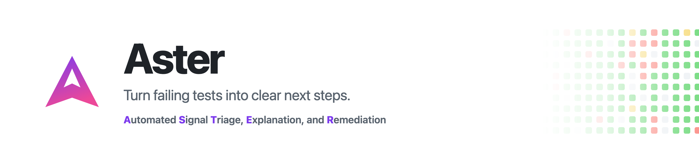

<p align="center">
  <picture>
    <source media="(prefers-color-scheme: dark)" srcset="docs/assets/aster-banner-dark.png">
    <source media="(prefers-color-scheme: light)" srcset="docs/assets/aster-banner-light.png">
    
  </picture>
</p>

## **Aster**: **Automated Signal Triage, Explanation, and Remediation**.

Aster is an evidence-first failure analysis and guarded-remediation engine for
[Prow](https://docs.prow.k8s.io/docs/overview/) and Kubernetes test infrastructure. It watches Prow and TestGrid jobs,
investigates failures through bounded logs, test results, artifacts, history,
and source evidence, and helps maintainers move from signal to explanation to a
reviewed next step.

## Who Aster is for

Aster is for maintainers and platform teams that already operate Prow jobs, or
publish compatible job artifacts, and want a shared failure-analysis dashboard.
It supports a public, read-only GitHub Pages deployment and a Kubernetes
deployment with persistent data, authentication, chat, and guarded actions.

## Quickstart

From a checkout of the repository whose jobs you want to monitor, run the
guided wizard at an exact released version:

```bash
go run github.com/willie-yao/aster/backend/cmd/aster@v0.9.0-rc.9 onboard \
  -engine-ref v0.9.0-rc.9
```

The wizard discovers matching Prow jobs, reviews deployment and AI choices,
validates the complete plan, and writes a small consumer repository only after
confirmation. The explicit engine ref pins a generated Pages workflow to the
same exact release. It does not require an Aster source checkout.

Continue with [Onboarding a project](docs/onboarding-a-new-project.md). Flagged,
dry-run, pull-request, and non-interactive usage is in the
[onboarding reference](docs/onboarding-reference.md). A coding agent can run the
same engine-owned workflow with `$setup-aster-consumer`; installation and safety
boundaries are in the onboarding quickstart.

## Choose a deployment

| Need | Use |
| --- | --- |
| Fast evaluation or a public read-only dashboard | [GitHub Actions and Pages](docs/github-pages.md) |
| A private in-cluster model endpoint or persistent shared data | [Kubernetes with Helm](docs/kubernetes.md) or [Flux GitOps](docs/kubernetes-gitops.md) |
| Authenticated chat, File Issue, or Mark Resolved | [Kubernetes with Helm](docs/kubernetes.md) |
| No cluster to operate | [GitHub Actions and Pages](docs/github-pages.md) |

Both deployment paths use the supported in-process analyzer. Pages publishes
static JSON and assets. Kubernetes adds a server for authentication, chat, and
guarded actions. Nothing files an issue or opens a pull request on a schedule;
both are maintainer-confirmed actions. The scheduled pass has only two GitHub
write paths, each opt-in and off by default: recovery on an issue it already
tracks, which comments and optionally closes, and the bot comment on a newly
opened pull request. Fix PR generation is not part of standard onboarding.

## Documentation

- [Onboarding](docs/onboarding-a-new-project.md)
- [GitHub Pages](docs/github-pages.md)
- [Kubernetes](docs/kubernetes.md)
- [Flux GitOps](docs/kubernetes-gitops.md)
- [Project configuration](docs/project-configuration.md)
- [Pull request triage](docs/pull-request-triage.md)
- [Optional features and enablement order](docs/README.md#optional-features)
- [Troubleshooting](docs/troubleshooting.md)
- [Complete documentation map and contributor guides](docs/README.md)

## License

[Apache License 2.0](LICENSE)
