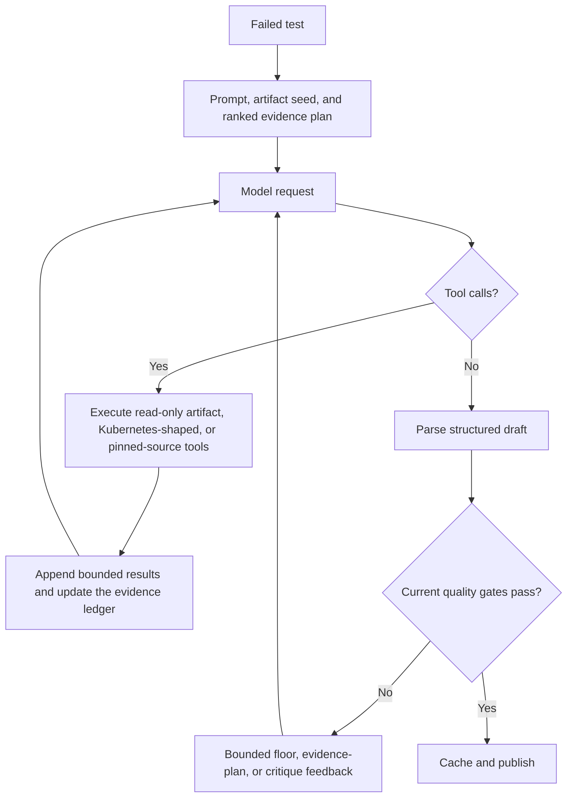

# Agentic analysis

Aster uses one authoritative failure-analysis path. For each failed test, the in-process analyzer lets the model inspect bounded artifacts and pinned source through read-only tools, then applies engine-owned quality gates before caching and publishing the result.

There is no separate text-only mode. When AI is enabled, every analysis uses the tool and evidence loop. For the contributor control-flow map, see [In-process failure analyzer architecture](architecture/in-process-analyzer.md).

## Runtime ownership

The fetcher and worker call the dashboard-owned `FailureAnalyzer` directly on both GitHub Pages and Kubernetes. The same Go implementation owns:

- provider requests and tool schemas;
- evidence planning and investigation bounds;
- deterministic critique and bounded repair;
- cache identity and acceptance;
- public analysis output;
- private traces and usage accounting.

## Requirements and configuration

Analysis requires a configured endpoint and model that support OpenAI-compatible function calling. Unsupported tool calls produce an explicit unavailable result. See [AI providers](ai-providers.md) for protocol and credential setup.

Exact `project.yaml` fields and defaults belong in [Project configuration](project-configuration.md). The main operational controls are:

| Control | Purpose |
| --- | --- |
| `ai.max_iters` | Bounds model and tool rounds for one failure. |
| `ai.timeout` | Bounds one analysis wall-clock duration. |
| `ai.min_tool_calls` | Requires a minimum number of investigation calls before finalization. |
| `ai.min_gcs_bytes` | Requires content-bearing artifact reads, subject to bounded anti-thrash behavior. |
| `ai.single_tool_call` | Restricts one tool call per assistant turn for model templates that require it. |
| `ai.tools` | Selects registered read-only tool groups. |
| `ai.concurrency` | Runs independent analyses in parallel. Keep it low for rate-limited providers. |
| `ai.critique.*` | Selects bounded repair and cache acceptance policy. |
| `AI_CACHE_GENERATION` | Creates an intentional reversible reanalysis namespace. |

Start with defaults. Raise investigation floors only when observed analyses finalize without enough evidence. Enable `single_tool_call` only when the model or serving template rejects parallel tool calls.

## Tool and evidence loop

The model can list, read, tail, grep, and find artifacts. Timeline verification orders timestamped events so causal claims can distinguish initiating failures from later cleanup noise. Optional Kubernetes-shaped tools navigate resources already present in the artifact tree; they do not connect to a live cluster. Pinned-source tools are read-only and available only when build metadata resolves an immutable repository revision.

The analyzer has no shell, browser, portal, SSH, cluster write, repository write, or GitHub action capability.

### Cause ownership

A build pins an immutable revision only for the project's own source repository, so only paths in that repository can be verified and published as linked evidence. When the responsible code lives in a dependency, the analysis records the owning repository and its reported paths separately.

That location is reported, never acted on. The dependency paths stay unverified hints, are excluded from the verified-source contract, and change no write gate: issue and Fix generation still require the failure, analysis source, and destination to be the same repository at an immutable revision. A dependency cause is surfaced as an upstream diagnosis with the repository named, and its remediation says the change belongs upstream instead of offering project automation that cannot reach the defect.

A recurring causal group reports ownership only when every build it covers reached the same conclusion. Mixed or missing ownership leaves the group unattributed.

### Evidence planning

Before the first provider call, the engine ranks evidence groups from the failure signal, selected diagnostic skills, and the bounded artifact tree. The model may follow that plan or inspect other available evidence. Coverage is factual: a group counts only when a content-bearing operation returns relevant data.

The plan stays visible while the model works. Every tool result that still has outstanding groups returns `unread_evidence_groups`, and a tools-free answer that leaves an available group unread reopens the investigation with the group and its candidate paths named. Groups the draft's own wording newly required are included, so a diagnosis that shifts mid-investigation still gets its evidence read. The reopen is bounded: it stops once the model stops making progress, after a small number of attempts, or when time, context, or byte budgets run short. A group with no candidate in the build is deterministically unavailable and never reopens the loop.

Consumer `skills/*.yaml` can require evidence for a failure class. They extend the engine profile; they do not replace the project prompt or authorize actions. See [Diagnostic skills](skills.md).

### Context and evidence bounds

The engine obtains the model context limit when the endpoint reports it, reserves completion and protocol headroom, and counts each estimated serialized request byte as one token plus a fixed framing reserve. This provider-neutral bound may compact log, YAML, and JSON histories before a tokenizer-specific limit, but it keeps the hard preflight independent of the endpoint tokenizer. Old tool results may be compacted while retaining call/result pairing, the evidence ledger, and current repair instructions. If a safe request cannot fit, the engine does not send it.

Investigation floors run on the finalize branch:

- `min_tool_calls` rejects a final that stopped before the required number of calls.
- `min_gcs_bytes` counts bytes returned by content-bearing artifact operations, not directory listings.
- Evidence-plan coverage can satisfy the byte-depth purpose when the required evidence groups are actually covered.
- A bounded byte-only retry prevents a weak model from looping indefinitely to satisfy a raw byte target.

Floors measure investigation effort, not correctness. Evidence-plan coverage is a separate gate that measures whether the available evidence was actually read. Critique remains independent of both.

## Deterministic critique

Every parseable final is evaluated in its exact sanitized publication form.

The deterministic judge rejects hard safety or grounding failures such as:

- an investigation checklist presented as the remediation;
- a remediation that leaves nothing to act on, such as a rerun instruction;
- a citation to an artifact that was never read;
- missing required artifact citations after evidence was read;
- invalid source or artifact paths and ranges, including quotes absent from cited lines;
- missing evidence required by an applicable diagnostic skill.

When configured, one bounded repair operation can inject verified evidence, allow one tool-enabled turn when evidence remains unresolved, and force one structured finalization. It does not reopen an unlimited investigation loop. Cache acceptance is evaluated separately under the configured critique policy.

Safe structured output is published as `preliminary` or `citations_verified`. `citations_verified` means each retained citation names a safe artifact path that was read, uses a valid line range, and quotes text present in that range, with no unresolved critique warning that degrades the disposition. It does not verify that the quoted evidence entails the initiating cause, supports every causal link, or makes the conclusion correct.

If a repair response is unusable, the engine can retain the best earlier parseable draft. Only the selected draft controls cache acceptance and publication.

## Cache semantics

A reusable entry must match the analysis key, be within the retention window, contain a valid current-format result, meet current investigation floors, and satisfy the current critique contract.

Aster checks both places that may hold an analysis:

1. the analysis attached to cached build data;
2. the private agentic cache.

This prevents an old build result from bypassing a newer floor or critique version. Cache hits do not call the provider and record zero new usage.

Entries retain content-free provenance for the prompt, provider coordinates, model, and loaded skills. Those fingerprints describe how an entry was produced; changing them affects new analyses but does not automatically invalidate an otherwise reusable entry.

Set `AI_CACHE_GENERATION`, the Pages `ai-cache-generation` input, or Helm `analysisCache.generation` to a new non-empty value for an intentional full rebaseline. Returning to a previous value reuses its still-valid entries. Destructive cache clearing is an emergency operation, not the normal response to prompt or provider changes.

## Pattern analysis

Recurring-pattern analysis is a separate pass over published per-build results. It correlates failures across builds, validates structured causal groups, and publishes only engine-derived identities and safe causal content.

A fresh valid verdict replaces the previous pattern. A fresh non-systemic verdict removes it. When an eligible refresh fails, the exact prior valid verdict may remain visible as `Last known good`; otherwise no fallback is fabricated. Retained patterns stay readable but cannot start notifications, issues, Fix previews, or resolution changes.

Causal groups are analysis-only. When every member build remains available, an authenticated cause-scoped chat can inspect those failed builds and the newest later completed run. The later run is comparison evidence, not cause membership. Cause chat derives the existing observation-only recovery streak from that group's builds, but a passing comparison does not prove a fix: the model must compare the representative test and triggering inputs.

Interactive cause turns bind `primary` to the configured repository at the selected failed-build revision. When the tested branch resolves, they also bind `current` to its current immutable tip; equal revisions reuse `primary`. Source citations are validated against same-turn evidence for the exact catalog entry. A proposed revision is retained only when it cites the effective current source. If the branch tip is unavailable or current code was not cited, the proposal is removed with an evidence warning and current fix status remains inconclusive. Changed or absent current code also requires investigation rather than implying that the cause is fixed. Engine-prepared first answers remain historical-only and do not perform this current-source lookup or qualification.

Chat returns prose with verified citations and does not grant File Issue or Fix PR eligibility. A fix still starts from a representative exact JUnit failure. Its historical file links are candidate paths only. Preflight resolves the explicit tested branch, preserves the failure-revision ancestry check, and reads, verifies, and hashes those paths at the current generation-base revision. Preview confirmation repeats the branch, revision, source-hash, and finding checks before any write.

## Private operational data

The analyzer writes private traces and usage ledgers beside the public output. They are excluded from `/data/*` and removed from Pages publication.

Private traces retain bounded control-flow facts such as provider attempts, logical request size, Responses wire-request size, tool counts, compaction, floor nudges, evidence-plan coverage and the group IDs it reopened for, critique stages, timeouts, and completion status. They do not retain prompts, assistant text, reasoning, tool arguments, tool output, credentials, endpoint URLs, or raw provider bodies. Authenticated server mode can expose the sanitized trace snapshot to administrators.

Usage ledgers retain provider-reported token categories and operator-priced cost coverage. Missing metadata stays unavailable. They never estimate hidden usage or store prompts, responses, endpoints, credentials, or repository content.

## Troubleshooting

- **No analyses appear:** confirm AI is enabled and startup logs show the configured agentic analyzer. Validate `project.yaml` and the non-empty project prompt.
- **Every analysis says the endpoint rejected tools:** select an endpoint and model with function calling. There is no text-only fallback.
- **Analyses finalize too early:** inspect the `evidence_plan` events in private traces to see which groups were left unread and why the loop stopped reopening. Then raise `min_tool_calls` or `min_gcs_bytes` gradually. Do not use large floors as a substitute for a clear project runbook.
- **The model loops:** lower `max_iters`, verify the prompt gives a decisive triage order, and check whether the provider correctly replays tool history.
- **Requests exceed the context limit:** use a model with a larger window or reduce project-prompt and artifact noise. The engine will not send a request that its conservative guard considers unsafe.
- **Provider throttling:** reduce `ai.concurrency`. It is independent of fetcher artifact workers.
- **Costs changed after a rollout:** inspect private usage coverage and traces. Do not infer cost from bytes when the provider omitted usage metadata.

## Implementation map

- `backend/internal/ai/agentic.go`: provider loop, finalization, repair, and draft selection.
- `backend/internal/ai/evidenceplan/`: ranked evidence planning.
- `backend/internal/ai/skills/`: engine and consumer evidence recipes.
- `backend/internal/ai/critique.go`: deterministic critique.
- `backend/internal/ai/service.go`, `cache.go`, and `cache_acceptance.go`: cache identity and acceptance.
- `backend/internal/ai/tools/`: read-only artifact, Kubernetes-shaped, and source tools.
- `backend/internal/aiusage/`: private usage accounting.
