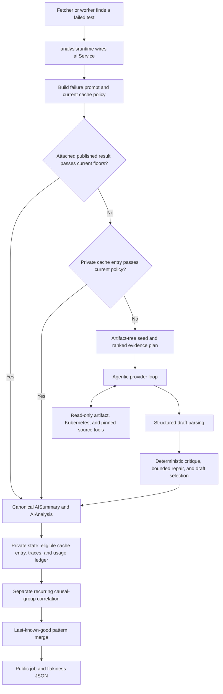

# In-process failure analyzer architecture

This document describes the authoritative per-build failure analyzer used by
Aster. It focuses on implementation ownership and control flow.
Configuration details remain in [Agentic analysis](../agentic.md),
[Project configuration](../project-configuration.md), [AI providers](../ai-providers.md),
and [diagnostic skills](../skills.md).

## Architectural role

The dashboard owns failure-analysis policy. Both the GitHub Pages workflow and
the normal Kubernetes deployment run the same Go analyzer through the fetcher
or worker. `backend/internal/analysisruntime` wires project configuration,
provider transport, tools, budgets, cache, and usage recording. The
implementation that decides what to publish is `backend/internal/ai`, exposed
through the `ai.FailureAnalyzer` interface and implemented by `ai.Service`.

The Kubernetes API server serves published data and optional interactive
features. It does not replace the fetcher or worker as the owner of scheduled
failure analysis.

Optional Agent Sandbox analysis shadows run after an authoritative refresh and
write private comparison ledgers. They do not replace the published result or
participate in normal analysis cache acceptance.

Safe structured output has a separate publication disposition:

- `preliminary` is displayable with bounded warnings but remains eligible for
  reanalysis and cannot feed patterns, actions, or Fix;
- `grounded` has verified artifact citations and no unresolved grounding or
  quality warnings;
- rejected output has no usable `AIAnalysis` and follows the existing unavailable
  path.

Action eligibility is never stored as analysis state. It is derived later from a
grounded result plus the existing critique version, source verification,
authentication, confirmation, deduplication, and Sandbox controls. Cache
acceptance remains independent from safe publication.

The disabled-by-default Agent Sandbox OpenCode analyzer is the implementation
used by scheduled shadowing and explicit evaluation tests. The benchmark uses a
pre-populated private input claim; scheduled shadowing uses a tokenless
namespace-local publisher Job. Both paths share the same staged workspace,
executor, result validation, and cleanup contract. Neither has public output or
normal cache authority.

## End-to-end flow

`backend/cmd/aster` calls `fetcher.Run` for a one-shot refresh.
`backend/cmd/worker` calls `fetcher.RunWatch` for repeated refreshes. After job
discovery, artifact loading, JUnit parsing, and aggregation,
`fetcher.analyzeFailuresWithAI` schedules each failed `models.TestCase` through
the shared `FailureAnalyzer` contract.

The scheduling pass and `ai.Service.analyze` both revalidate an analysis already
attached to a cached build. Preliminary results remain reanalysis-eligible. The
service checks the private agentic cache before artifact-tree scanning,
evidence-plan construction, and provider calls. Normal cache policy is stricter
than safe publication and can reject a preliminary result without hiding it.

## Prompt composition and skills

Project startup calls `analysisruntime.LoadProject`. The system prompt has a
fixed ownership order:

1. engine `ai.BasePrompt`;
2. the mandatory consumer `prompts/system.md`, under a project-specific heading;
3. engine `ai.ResponseFormatFooter`;
4. engine agentic tool guidance appended when `doAnalyzeAgentic` starts.

The per-failure user message comes from
`backend/internal/ai/modules/universal`. It contains bounded failure metadata,
the failure message and body, and starting tool suggestions. The service adds
bounded Prow job metadata. Normal in-process execution analyzes one test per
request. After a private cache miss, the agentic loop prepends a bounded
artifact-path seed and any ranked evidence plan.

Skills are not another free-form prompt layer. Engine profiles and consumer
`skills/*.yaml` files are loaded into one deterministic set. The Prow profile is
always selected; Kubernetes recipes are selected when Kubernetes tools are in
the effective tool configuration. The initial failure signal selects evidence
plans before the first model call. Later, draft text selects applicable recipes
for critique, evidence requirements, and bounded repair. The merged skill hash
is retained as provenance.

## Investigation tools and boundaries

The authoritative loop is function-calling only. An endpoint that rejects tools
makes analysis unavailable; there is no tools-free diagnostic fallback.
`analysisruntime.New` registers these read-only capabilities:

- `filesystem`: list, find, read, tail, grep, and timeline operations over one
  build's artifact browser;
- `k8s`: optional discovery helpers that navigate Kubernetes-shaped artifact
  trees without contacting a live cluster;
- `repotree`: read-only list, read, and grep operations added automatically only
  when the build resolves to an immutable source repository revision.

No authoritative analysis tool can execute a shell command, modify artifacts,
patch source, call GitHub write APIs, or change a cluster.

The main boundaries are layered rather than represented by one counter:

| Boundary | Enforcement |
| --- | --- |
| Tools | Only enabled registry schemas are sent. `single_tool_call` can limit one call per turn. |
| Iterations | `max_iters` bounds normal provider turns; bounded repair and finalization receive only guarded extra turns. |
| Time | The per-failure timeout is capped by the parent fetch context. Repair also requires explicit time headroom. |
| Artifact bytes | A fixed engine GCS ceiling limits bytes fetched by artifact and Kubernetes tools. |
| Model-visible bytes | A context-derived model-byte budget and per-tool result caps bound inserted evidence. |
| Context | The runtime prefers an operator context-window override, then provider metadata, then a bounded fallback. A conservative one-byte-per-token estimate reserves completion and finalization headroom. |

Before each provider request, old tool results may be compacted into bounded
stubs while recent evidence remains verbatim. If the request still cannot fit,
the loop publishes the best previously selected draft when one exists or marks
the analysis unavailable.

## Evidence and citations

The loop takes one bounded artifact-tree snapshot for the path seed and ranked
skill evidence plan. A plan group is covered only by a successful, non-empty
content read that matches the required path and any same-artifact content
predicates. Complete plan coverage can satisfy the evidence-byte floor without
requiring arbitrary extra reads.

Only content-bearing `read_artifact`, `tail_artifact`, and `grep_artifact`
results count as artifact evidence. Directory listings, failed calls, empty
results, and guessed paths do not. Source reads are tracked separately so
source-file claims cannot be justified by artifact reads.

The loop retains a bounded line ledger from the exact model-visible artifact
payloads. `evidence_citations` are validated against that ledger for safe path,
line range, and exact quote. Deterministic critique also rejects unread artifact
or source citations. Before publication, invalid citations are removed and
unsupported line-number claims are stripped. The public citation list therefore
reflects evidence actually returned to the model, not paths merely present in
the artifact tree.

`min_tool_calls` and `min_gcs_bytes` are cacheability floors. If a model tries to
finish below a floor, the loop can nudge it to continue investigating. A final
result may still be publishable under the configured critique policy while
remaining ineligible for cache persistence.

## Draft lifecycle and selection

Model output is never accepted directly. The current lifecycle is:

1. A tools-free response is parsed into the `analysisResponse` JSON shape.
   Parseable JSON attached to a tool-bearing turn is retained only as a fallback
   candidate while the requested tools still run. If the loop exhausts
   iterations or the response does not parse, one finalization request forces
   the exact `submit_analysis` function schema with ordinary investigation tools
   absent.
2. Deterministic critique checks citation integrity, unread paths, unsafe or
   unverified source paths, unsupported line claims, persistent-failure versus
   transient conflicts, remediations that leave nothing to act on, remediation
   punts, and recipe-required evidence.
3. When permitted by retry, time, context, and evidence budgets, critique can
   inject bounded missing evidence, allow another tool turn, and request a
   revised structured draft.
4. Deterministic draft selection keeps the best parseable candidate. A
   replacement cannot introduce a hard-rule regression, and a changed root cause
   requires new evidence.

Critique rules are classified as hard failures or soft warnings. Hard findings
cover structural, citation, source-grounding, and contradiction failures. Soft
findings cover evidence availability and remediation-quality warnings. The
configured cache policy determines which classifications block reuse:
`strict` accepts almost no warnings, `hard` blocks hard findings, and `advisory`
records findings without making critique itself a cache barrier.

If finalization fails, the loop prefers an earlier parseable draft, including a
strict structured candidate attached to a tool-bearing turn. The selected draft
still passes normal publication sanitization, critique classification, and
analysis disposition. When no parseable draft exists, the result remains
unavailable. Finalization recovery does not change pattern, correction,
remediation, action, or Fix eligibility.

## Cache and current-floor revalidation

The private cache key scopes the universal module, optional cache-generation
fingerprint, job, build, and a short hash of the test name plus normalized
failure message. Build scope is required because analyses cite build-specific
paths and lines.

Cache data records the structured result plus investigation counters, critique
state, and model, prompt, and skill fingerprints. The model hash is
a one-way fingerprint of provider API mode, endpoint, model, and reasoning
effort. These fingerprints are provenance, not automatic invalidation selectors.
A model, endpoint, prompt, skill, or failure-streak change affects new results
but does not by itself reject an otherwise current entry.

Every attached or private entry is reconstructed and checked against the current
contract. Reuse requires a valid, unexpired agentic result that meets current
tool and evidence floors, the current critique version and configured critique
policy, and the current cache generation. A
rejection is treated as a miss without deleting all cache state, so a later run
can reuse entries under a compatible configuration.

Normal floor changes and critique-version changes do not need a generation
change because current-floor revalidation handles them. Prompt, model, endpoint,
and skill changes also do not require one, but they do not force reanalysis. Set
`ai.cache_generation` only when an operator intentionally wants a reversible
full rebaseline that existing acceptance gates would otherwise allow.

## Publication and private state

Public job JSON contains the failure summary, root cause, severity, suggested
fix, grounded evidence citations, source links, and intentionally exposed
per-analysis telemetry such as tool calls, context and artifact bytes, elapsed
time, cache or same-failure reuse, budget state, critique status, and provenance
fingerprints. The provider model name is not serialized.
The in-process path records provider-reported token and cost details in private
traces and usage ledgers rather than copying those totals into the public
analysis object.

After the separate pattern pass, `patterns.MergeLastGood` classifies each job's
refresh as current, retained, failed or unavailable, or not applicable. A failed
eligible refresh retains a prior valid pattern when one exists and otherwise
publishes no fabricated fallback. The resulting causal-group projections are
published in job details and aggregated into `flakiness.json`.

Raw provider exchanges are transient and are not included in traces or public
output. Private persisted state includes `ai_cache.json`, `ai_traces.json`,
fetcher and server usage ledgers, fetch status, side-effect state, Agent Sandbox
comparison ledgers. Pages strips private
files before deployment, and the Kubernetes server rejects them from the
data-serving path.

## Downstream and separate operations

The analyzer publishes evidence and diagnosis. Other packages consume that
output through separate authority and lifecycle gates:

| Surface | Owner and boundary | Guide |
| --- | --- | --- |
| Recurring causal groups | `backend/internal/patterns` correlates representative published failures. It cannot rewrite a per-build diagnosis, and per-job failures are isolated by last-known-good publication. | [Agentic analysis](../agentic.md#pattern-analysis) |
| Analysis chat | `backend/internal/analysischat` resolves one published test, pattern, or causal group into a bounded private conversation. Cause scope exposes that group's failed member builds plus one newer completed comparison run when available. Chat does not mutate job JSON. | [Server mode](../server.md#analysis-chat) |
| Resolution and actions | `backend/internal/actions` and `backend/internal/resolve` operate on current published subjects. Issue and Fix writes use preview and confirmation. Pattern and cause resolution update private lifecycle state. | [Server mode](../server.md#admin-gated-actions) |
| Fix PR generation | `backend/internal/fixpr` and `backend/internal/fixruntime` bind an eligible subject, immutable source, a canonical patch, validation, review, and confirmation. | [Fix PR generation](../fix-prs.md) |
| Pull request triage | `backend/internal/prtriage`, `prattribution`, `prescalation`, and `prcomment` own deterministic attribution, shared failures, optional escalation, and the separately gated GitHub App comment. | [Pull request triage](../pull-request-triage.md) |
| Agent Sandbox analysis shadow | `backend/internal/fetcher`, `agentanalysis`, `analysispublisher`, `analysisstager`, and `analysisexecutor` compare a private sampled result after authoritative publication. Shadow output and cleanup state cannot change public output or normal cache acceptance. | [Agent Sandbox OpenCode analyzer](../maintainer/agent-sandbox-opencode-analyzer.md) |

## Contributor map

| Change | Start here |
| --- | --- |
| Fetcher entry and runtime wiring | `backend/internal/fetcher/analysis.go`, `backend/internal/analysisruntime/runtime.go` |
| Per-failure contract | `backend/internal/ai/runner.go`, `backend/internal/ai/service.go` |
| Provider wire format | `backend/internal/ai/transport.go`, `backend/internal/ai/transport_chat.go`, `backend/internal/ai/transport_responses.go` |
| Authoritative provider loop and finalization | `backend/internal/ai/agent_loop.go`, `backend/internal/ai/agentic.go`, `backend/internal/ai/finalization.go` |
| Context and agentic tool execution | `backend/internal/ai/context.go`, `backend/internal/ai/tool_execution.go`, `backend/internal/ai/tools/` |
| Shared downstream tool and structured execution | `backend/internal/ai/toolloopcore.go`, `backend/internal/ai/structured.go` |
| Prompt composition | `backend/internal/ai/compose.go`, `backend/internal/ai/baseprompt.go`, `backend/internal/ai/responseformat.go`, `backend/internal/ai/modules/universal/` |
| Evidence planning, coverage, and repair | `backend/internal/ai/evidenceplan/`, `backend/internal/ai/skills/`, `backend/internal/ai/evidence_repair.go` |
| Deterministic critique and draft selection | `backend/internal/ai/critique.go`, `backend/internal/ai/critique_rules.go`, `backend/internal/ai/draft_selection.go` |
| Cache identity and acceptance | `backend/internal/ai/service.go`, `backend/internal/ai/cache.go`, `backend/internal/ai/cache_acceptance.go` |
| Public and cache analysis projection | `backend/internal/ai/analysis_record.go`, `backend/internal/models/models.go`, `backend/internal/output/` |
| Private trace and usage output | `backend/internal/ai/trace.go`, `backend/internal/ai/trace_store.go`, `backend/internal/aiusage/` |
| Recurring patterns | `backend/internal/patterns/`, `backend/internal/ai/pattern.go`, `backend/internal/ai/pattern_repo.go`, `backend/internal/ai/pattern_verification.go` |
| Analysis chat and published-analysis resolution | `backend/internal/analysischat/chat.go`, `backend/internal/analysischat/resolution.go` |
| Confirmed action requests | `backend/internal/actions/requests.go`, `backend/internal/actions/request_generation.go`, `backend/internal/actions/request_state.go`, `backend/internal/actions/request_cleanup.go` |
| Fix PR runtime | `backend/internal/fixpr/`, `backend/internal/fixruntime/` |
| Scheduled analysis shadows | `backend/internal/fetcher/shadow_analysis.go`, `backend/internal/agentanalysis/workspace*.go`, `backend/internal/analysispublisher/`, `backend/internal/analysisstager/`, `backend/internal/analysisexecutor/` |
| Agent Sandbox analyzer benchmark | `backend/benchmarks/agent_sandbox_analyzer_benchmark_test.go`, `hack/compare-agent-sandbox-analyzer-benchmark.py` |
