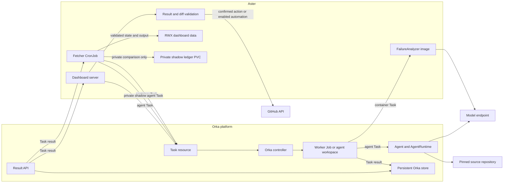

# Experimental Orka maintainer reference

> **Status: experimental maintainer and evaluation material.** Orka is not part
> of standard onboarding. The supported Pages and Kubernetes deployments run
> analysis in-process. The dashboard chart does not install Orka, and no verified
> published Orka installation is currently recommended.

Orka is a separate cluster-level controller, CRD, Task, and credential system.
Use this page only for isolated maintainer evaluation of a concrete lifecycle or
workspace-isolation requirement.

The dashboard contains four independent experimental integration points:

- Private Agent analysis shadowing.
- Containerized failure analysis.
- Read-only source investigation from analysis chat.
- Fix PR generation.

Enabling one integration does not enable the others. Analysis chat, File Issue,
and Mark Resolved use the standard server and do not require Orka.

## Installation status

This repository does not configure a verified published Orka chart and runtime
release. There is no recommended turnkey cloud-cluster installation.

The [CAPZ Orka demo](https://github.com/willie-yao/capz-prow-ai-dashboard-orka-demo/tree/main/deploy/orka)
is a maintainer safety harness, not a beginner or production deployment example.
Its installer correctly refuses to run while these release fields are missing:

```text
ORKA_CHART_REFERENCE
ORKA_CHART_VERSION
ORKA_CHART_DIGEST
ORKA_CONTROLLER_DIGEST
ORKA_AI_WORKER_DIGEST
ORKA_GENERAL_WORKER_DIGEST
ORKA_HARNESS_WRAPPER_DIGEST
```

Do not invent a chart URL, publish an unofficial release, or substitute mutable
`main` or `latest` image tags. The chart source version alone is not evidence of
a published release.

The minimum source revision currently required by the dashboard integration is:

```text
fde3b7925c367784570fcc36d7a5b3a51747bf10
```

A usable published release must contain that revision or a later compatible
revision and publish:

- The Helm chart.
- Controller image.
- AI worker image.
- General worker image.
- Agent harness-wrapper image.

Pin the exact chart version, chart package digest, and all four image digests.
A digest for only the controller is not sufficient.

## Future verified-release checklist

If maintainers later publish and record complete immutable release metadata in
an evaluation repository, its installer must require an explicit context:

```bash
export CONTEXT="<explicit-kubernetes-context>"
export ORKA_RELEASE="orka"
export ORKA_NAMESPACE="orka-system"

./deploy/orka/install.sh \
  --context "$CONTEXT" \
  --release "$ORKA_RELEASE" \
  --namespace "$ORKA_NAMESPACE"
```

At the current unconfigured release state, this command must refuse before
changing the cluster. Do not bypass that refusal or treat the script as an
ordinary setup path.

The installer must:

1. Require an explicit context, release, and namespace.
2. Download the exact chart package.
3. Verify its SHA-256 digest before Helm reads it.
4. Render every runtime image as `tag@sha256:digest`.
5. Refuse an existing Orka release during a fresh install.
6. Install and wait for the release.
7. Validate CRDs, controller, services, storage, RBAC, and running image digests.
8. Record non-secret version evidence.

The dashboard install remains separate and must never invoke Orka installation
implicitly.

## Source-SHA maintainer evaluation

Packaging a chart from an exact source commit is a maintainer-only evaluation
path. It can support lint, render, and disposable kind testing. It does not
provide matching released runtime images and is not an ordinary installation or
cloud-cluster shortcut.

See `experimental/orka/README.md` and
`experimental/orka/run-container-analyzer-kind.sh` for the disposable engine
integration test. Do not adapt that path into production installation guidance.

## Readiness checks for a future verified release

A fresh compatible chart install creates 12 cluster-scoped Orka CRDs from the
chart `crds/` directory before templated release resources. It also manages:

- The controller, Service, and controller RBAC.
- Worker ServiceAccounts and RBAC.
- Harness-wrapper Deployment and Service.
- Release-local authentication state.
- The persistent result store.

After installation:

1. Wait for every CRD to become `Established`.
2. Verify controller and harness-wrapper readiness.
3. Verify the REST Service and store PVC.
4. Verify controller permissions for required resource kinds.
5. Verify worker identities.
6. Verify rendered and running images match all pinned digests.

Do not broaden a dashboard ServiceAccount to compensate for an Orka controller
installation error.

The Orka chart does not create model credentials or a project Agent. Create the
Agent model Secret separately, apply a reviewed Agent with the endpoint-specific
model ID, and wait for its `Ready` condition.

The dashboard's generic Orka generation runtime treats the referenced Agent as
the owner of model endpoint, model ID, credentials, and outbound policy. It
rejects local provider fields rather than copying or ignoring them. When an
engine caller supplies a bundled skill, the dashboard validates the skill and
adds its exact contents to a trusted Task-prompt preamble. Current Orka Agent
Tasks do not support per-Task skill overrides, so the dashboard does not modify
the operator-owned Agent.

Onboarding may opt into this backend with `aster onboard
--prompt-mode=agent --prompt-agent-runtime=orka`. Supply the Orka result API and
Agent reference through `--prompt-orka-api` and `--prompt-orka-agent-ref`.
Namespace and read-only private-clone Secret overrides are optional. The local
OpenCode model and network flags are intentionally rejected in this mode.

For an OpenCode Agent:

- Set `spec.runtime.type: opencode`.
- Put `OPENAI_BASE_URL` in the Agent model Secret.
- Add `OPENAI_API_KEY` only when the endpoint requires authentication.
- Keep any private-repository clone credential separate and read-only.
- Never give the Agent a dashboard GitHub write token.

See `configs/example/orka-opencode-agent.yaml` for the manifest shape. Do not
apply it without replacing and reviewing all placeholders.

## CRD-first upgrades

Helm installs files under `crds/` during a fresh install but does not upgrade
those CRDs. Upgrade the CRDs before the controller and stop every Task-producing
client until validation completes.

A safe upgrade is:

1. Acquire the cluster-wide `orka-crd-lifecycle` Lease.
2. Download or locate the exact target chart package.
3. Verify the chart package digest.
4. Read the exact target CRD inventory with `helm show crds`.
5. For each current CRD, read its `resourceVersion`.
6. Use a JSON Patch that tests that version before replacing the complete target
   `spec`.
7. Wait for all 12 CRDs to become `Established`.
8. Run the Helm upgrade with all runtime image digests pinned.
9. Wait for the controller and harness wrapper.
10. Run the full release validation before restarting Task producers.

The exact-spec replacement removes fields deleted by the target schema without
deleting custom resources. A plain `kubectl apply` can retain removed schema
fields and is not an equivalent upgrade.

Use the maintained consumer `deploy/orka/upgrade.sh` when verified release
metadata is available. It serializes the lifecycle and records a pre-upgrade
resource inventory.

## Uninstall and release topology

`helm uninstall` removes release-scoped resources, including a chart-managed
store PVC, but retains CRDs installed from `crds/`. Orka custom resources also
remain in the Kubernetes API.

Back up result-store data before uninstall when Task results or sessions must
survive. Deleting a CRD deletes every custom resource of that kind across the
cluster. Treat CRD deletion as a separate destructive operation and never make
it part of dashboard uninstall.

One cluster-wide Orka release may serve multiple dashboards. If multiple Orka
releases are required, each needs:

- A unique release name or `fullnameOverride`.
- An isolated controller namespace.
- A distinct non-empty `controller.watchNamespace`.

Do not combine a cluster-wide watcher with namespace-scoped releases whose
reconciliation or admission scopes overlap.

## Default in-process analysis

`analysisRuntime.type: inprocess` is the recommended default. It works in Pages
and in Kubernetes watch or cron mode. It keeps prompts, tools, evidence policy,
critique, semantic review, cache acceptance, traces, and result schemas inside
the dashboard implementation.

Use this mode for normal deployments. Evaluate an Orka path only in a separate
experimental rollout with a concrete lifecycle requirement.

## Private experimental Agent analysis shadow

The Agent analysis shadow keeps `analysisRuntime.type: inprocess` authoritative.
It remains disabled by default and private. Dashboard telemetry records exact
result-contract outcomes and observed lifecycle milestones, but does not claim
provider token usage, cost, live model identity, Orka result-store persistence
time, or completion of post-terminal Orka reconciliation.

After public output and side-effect processing finish, the worker or fetcher freezes
a bounded artifact evidence bundle and may submit one private `type: agent` Task.
The result is never published or used for cache acceptance, patterns, issues,
fixes, or remediation.

The Helm integration is disabled by default and supports watch or cron mode:

```yaml
ai:
  enabled: true
  githubReadTokenSecretName: github-read # required for private source verification

analysisRuntime:
  type: inprocess

orka:
  namespace: orka-system
  agentAnalysisShadow:
    enabled: true
    api: http://orka.orka-system.svc.cluster.local:8080
    agentVersion: v1
    maxPerRun: 1
    admission:
      agentRef: analysis-agent-v1
      repository:
        owner: example
        name: repo
      gitSecret: "" # optional existing read-only Secret in orka.namespace
      maxTurns: 12
      timeout: 10m
      retries: 0
    ledger:
      existingClaim: ""
      retain: true
      accessMode: ReadWriteOnce
      size: 1Gi
      storageClass: ""
```

With `orka.rbac.create=true`, the chart creates a dedicated shadow
ServiceAccount and Task-only Role. Otherwise the operator must supply the exact
ServiceAccount and equivalent Role. The chart always renders the
requester-scoped admission policy and a private PVC mounted only into the
writer. The server never mounts the shadow claim. Result retrieval uses the
projected ServiceAccount token. The Orka result API must authorize that exact
ServiceAccount.

Admission pins the Agent name and namespace, repository, immutable 40-character
commit, no-Bash tool policy, turn limit, timeout, retries, Task name version,
and fixed contract metadata. It also restricts deletes to exact shadow Tasks.
Kubernetes cannot prove that the operator-owned Agent or Git Secret is safe, so
use a versioned Agent name, audit its model and network policy, and keep the Git
Secret read-only.

Shadow analysis is mutually exclusive with Orka fix generation and Orka
container analysis in the first Helm version. Do not change admission identity
values while a shadow Task is active. The private ledger records bounded
attempt, duration, validation, retry, and cleanup state. A pending cleanup or
invalid result remains private and never changes the authoritative dashboard.

## Experimental Orka container analysis

Set `analysisRuntime.type: orka-container` to submit one content-addressed Orka
container Task per failure. This is an experimental Helm-only lifecycle
sidegrade for watch or cron mode. It has no backward compatibility guarantee
and is not recommended over in-process analysis.

The analyzer image still runs the dashboard `FailureAnalyzer`. Orka owns Task
and Job lifecycle, retries, timeout, and durable result transport. It does not
own prompts, evidence selection, tools, critique, cache acceptance, or final
result schemas.

Example values after Orka and all required Secrets are installed:

```yaml
analysisRuntime:
  type: orka-container
  orkaContainer:
    namespace: ""
    api: http://orka.orka-system.svc.cluster.local:8080
    apiAuth:
      existingSecret: ""
      tokenKey: token
    maxConcurrentTasks: 2
    pollInterval: 2s
    taskTimeout: 20m
    retries: 1
    image:
      repository: ghcr.io/willie-yao/aster/analyzer
      tag: "<immutable-engine-version>"
      pullPolicy: IfNotPresent
    modelAuth:
      existingSecret: "<model-secret-in-analysis-namespace>"
      tokenKey: token
    state:
      existingSecret: ""
      key: state-key
    nodeSelector:
      agentpool: "<cpu-agentpool>"
    tolerations: []
    affinity: {}
```

This configuration does not install Orka. `orkaContainer.api` must name the REST
Service of the separately installed release. The Service name is not derived
from its namespace.

### Result API authentication

With an empty `apiAuth.existingSecret`, the dashboard uses a projected rotating
ServiceAccount token and reloads it for each result request. Use a static Secret
only when the Orka API cannot accept that ServiceAccount identity.

Result API authentication is separate from the model token stored in the
analysis namespace.

### Timeouts and concurrency

`taskTimeout` must be at least the project `ai.timeout` plus two minutes for Task
startup and encrypted result finalization. The worker rejects a shorter outer
timeout instead of allowing Orka to terminate the analyzer before recoverable
state is emitted.

Watch passes never overlap. A long Task wave delays the next refresh. Do not
create a manual fetch Job while the watch worker exists.

### Task identity and reuse

Before creating analyzer Tasks, the worker applies private cache entries that
pass current identity, age, quality, critique, and malformed-state checks.
Subjects satisfied from private cache still count toward logical work, but do
not create Tasks.

If private cache misses, planning checks the exact content-addressed Task.
Exact reuse requires:

- A non-deleting succeeded managed Task.
- A durable result reference.
- The exact bundle digest and state-key fingerprint.
- The current analyzer contract.
- Authenticated encrypted state.
- Agreement between the encrypted cache entry and public result.
- Current investigation and critique gates.

If exact reuse misses, the worker can inspect a bounded set of recent succeeded
Tasks for the same work item. Compatible reuse preserves the result,
authentication, state, and quality contracts while allowing a previous Task
identity.

Task adoption does not relabel an existing Task. Private fetch-status state
retains the current-pass correlation.

### State Secrets

When `state.existingSecret` is empty, the chart creates retained matching
release-scoped state-key Secrets in the dashboard and analysis namespaces.

When providing an external state Secret, create the same Secret name and key in
both namespaces. Generate one shared random literal through an approved Secret
management path. Do not print the key or commit it.

The state key protects transported private cache and trace state. The model
Secret remains separate.

### Analysis namespace and admission

When `orkaContainer.namespace` is empty, the chart creates and retains a
namespace dedicated to the dashboard release. A custom namespace must satisfy
the chart release-scope rule. It must not be the Orka controller namespace, fix
runtime namespace, or dashboard namespace.

Keep only analyzer model and state Secrets in the analysis namespace.

Container analysis installs a fail-closed `ValidatingAdmissionPolicy` that pins:

- Analyzer image and arguments.
- Model coordinates.
- CPU placement.
- Bundle reference.
- Exact model and state Secret references.

The installer therefore needs permission to create cluster-scoped admission
policies.

The immutable input ConfigMap contains sanitized project policy, prompt, skills,
request data, and a bounded raw cache seed. It never contains model credentials.
Projects using custom `ai.headers` are rejected because the adapter has no secure
cross-namespace transport for those values. Use bearer-token authentication or
a trusted proxy.

Analyzer Tasks must run on CPU nodes. The chart requires an explicit CPU
`agentpool` selector and rejects accelerator selectors, affinity, and
tolerations that could place the analyzer on accelerator nodes. Run the Orka
controller and helper workloads on CPU nodes as well. Only the model-serving
workload should select GPU nodes.

## Experimental read-only source investigation

Source investigation is independent from failure-analysis runtime selection. It
uses an Orka Agent Task to inspect source for an authenticated chat session.
Enable it only after the Orka release, Agent, read-only repository credential,
and Task-only RBAC are ready.

Source investigation requires authenticated analysis chat and the Helm-side
source-investigation controller:

```yaml
server:
  chat:
    enabled: true
    sourceInvestigation:
      enabled: true
      serviceAccountName: ""
      admission:
        agentRef: "<guarded-read-only-agent>"
        repository:
          owner: "<github-owner>"
          name: "<github-repository>"
        gitSecret: "<read-only-clone-secret>"
        maxTurns: 30
        timeout: 10m
        retries: 1
  actions:
    enabled: false
    mode: oauth
    admins:
      - "<github-login>"
    oauth:
      clientId: "<oauth-client-id>"
      redirectUrl: "https://dashboard.example.com/api/auth/callback"
      existingSecret: "<oauth-secret>"
```

Configure a secure origin before enabling authenticated chat. See
[Server mode](../server.md) for OAuth, proxy authentication, admin allowlists,
NetworkPolicy, and origin requirements.

Project configuration shape:

```yaml
ai:
  source_investigation:
    agent_ref: "<guarded-read-only-agent>"
    api: http://orka.orka-system.svc.cluster.local:8080
    namespace: orka-system
    git_secret: "<read-only-clone-secret>"
    max_turns: 30
    timeout: 10m
    retries: 1
```

The Agent runtime must satisfy Orka's enforced read-only contract. Do not remove
the guard to make an unsupported runtime start. The clone Secret must contain
only read-only repository credentials. `agent_ref` and `api` are required.
`timeout` must be positive and no more than 30 minutes, `retries` must be `0`
through `2`, and a nonzero `max_turns` must be `1` through `1000`. Zero uses the
default turn limit.

The dashboard server uses a dedicated ServiceAccount with Task create, get,
patch, and delete permissions. A requester-scoped `ValidatingAdmissionPolicy`
pins the Agent, repository, immutable revision shape, exact read-only Git Secret,
read-only tool list, timeout, retries, and Task metadata. It rejects images,
commands, environment variables, alternate Secrets, Bash, write or network
tools, scheduling, webhooks, sessions, and placement overrides. The projected
ServiceAccount token is mounted only because the server must create and cancel
Tasks and read the authenticated Orka result API.

The server independently verifies returned source quotes against the pinned
commit. Private source repositories also require a separate read-only GitHub
token Secret for that verification. The Helm admission values intentionally
duplicate the security-sensitive `project.yaml` settings; a mismatch denies the
Task.

Source investigation does not require the git-capable fixer image and does not
enable write actions.

## Experimental Orka fix generation

Orka fix generation is independent from container analysis. Set:

```yaml
orka:
  fixRuntime:
    enabled: true
    admission:
      agentRef: "<orka-agent-name>"
      repository:
        owner: "<github-owner>"
        name: "<github-repository>"
      maxTurns: 30
      allowBash: true
      timeout: 15m
      retries: 1
```

Then configure the consumer project with the required Agent and result API
coordinates:

```yaml
ai:
  fix_prs:
    enabled: true
    agent_runtime:
      type: orka
      agent_ref: "<orka-agent-name>"
      api: http://orka.orka-system.svc.cluster.local:8080
      namespace: orka-system
      version: v1
      retries: 1
      max_turns: 30
      allow_bash: true
      timeout: 15m
```

This selects the git-capable fixer image, a separate Task-only Role, and a
fail-closed `ValidatingAdmissionPolicy`. The Helm admission values must match the
effective `project.yaml` values. A mismatch denies Task creation. Enabling
container analysis does not enable or configure fix generation.

The dashboard and Agent runtime settings are separate:

- `ai.fix_prs.agent_runtime.type: orka` selects Orka as the generation backend.
- `Agent.spec.runtime.type: opencode` selects OpenCode inside Orka.

The operator owns the Agent and model Secret. Put endpoint and model credentials
in the Agent Secret, not `project.yaml`. Guarded fix Tasks reject workspace Git
Secrets, so the repository must currently be publicly cloneable. `FIX_TOKEN`
stays in the dashboard workload and is never passed to the Agent, Task,
workspace, or model Secret.

The shared generation backend may receive engine-owned skills. The dashboard
validates their exact contents and includes them in a trusted prompt preamble
because Orka Agent Tasks do not support per-Task skill overrides. Skill contents
and runtime purpose are part of the Task fingerprint. The dashboard never
mutates the operator-owned Agent or its default skills.

See [Experimental Fix PR generation](../fix-prs.md#orka-experimental-in-cluster)
for project settings and identity boundaries.

The policy is scoped by the authenticated dashboard ServiceAccount and the Orka
namespace. It pins the exact Agent namespace, repository, immutable commit
shape, generation-only workspace, turn and Bash limits, timeout, retry policy,
priority, Agent-owned resources, and dashboard metadata. It rejects container
fields, Task and workspace Secret references, custom environment variables,
scheduling, sessions, webhooks, prior Tasks, mutable Git refs, tool overrides,
and placement overrides. Unrelated Orka requesters are not matched. Container
analyzer Tasks remain governed by the existing analyzer policy in their
dedicated namespace.

A dedicated fix Task namespace is not safe with the current Orka contract. Orka
can enforce same-namespace Agent references, and the Agent's namespaced Secret
cannot be mounted into a worker Job in another namespace without copying the
credential. Keep fix Tasks with the approved Agent in `orka.namespace` until
Orka provides a brokered credential and cross-namespace Agent contract.

Source investigation and fix actions can share one server pod while retaining
distinct Kubernetes requesters. The pod runs as the source-investigation
ServiceAccount. For fix generation, it requests a short-lived token for the
separate fix ServiceAccount through the Kubernetes TokenRequest API. The token
is bound to the current server Pod name and UID, cached only in memory, and used
for both fix Task requests and fix result reads. The source ServiceAccount has no
direct fix Task permission.

Chart-managed RBAC limits token creation to the exact fix ServiceAccount name in
the dashboard namespace. The fix ServiceAccount remains limited to its Task-only
Role and requester-scoped admission policy. If `orka.rbac.create=false`, the
operator must provide the equivalent `serviceaccounts/token` permission without
broadening either Task Role. Configurations that resolve source and fix to the
same ServiceAccount fail Helm validation.

When the dashboard namespace differs from `orka.namespace`, grant the dashboard
ServiceAccount access to the Orka result API. Prefer projected ServiceAccount
authentication. Use a static API token only when namespace policy cannot accept
that identity.

## Architecture and lifecycle

This section documents ownership, credentials, state, and failure boundaries for
maintainers evaluating an experimental integration.

### Where Orka is used

| Integration | Orka execution | Status | Main benefit |
| --- | --- | --- | --- |
| Failure analysis | One `type: container` Task per failure | Experimental Helm cron-only option | Isolation and per-failure Task history |
| Agent analysis shadow | Bounded `type: agent` comparison after in-process publication | Private experimental Helm option | Compare another runtime without changing authority |
| Fix generation | `type: agent` Task using an AgentRuntime such as OpenCode | Experimental | Isolated source workspace and structured diff result |
| Source investigation | Read-only `type: agent` Task at a pinned source revision | Experimental | Deeper source inspection with verified citations |

In-process failure analysis remains the default and recommended production
runtime. Enabling one Orka integration does not enable the others.

### Component overview



Orka is installed as a separate cluster-level release. A cluster may serve
multiple dashboards from one Orka installation, while each dashboard keeps its
own data volume, analysis namespace, project configuration, and credentials.

### Ownership boundary

The most important rule is that Orka owns execution lifecycle, not dashboard
policy.

| Concern | Owner |
| --- | --- |
| Prompt composition and project knowledge | Dashboard and consumer |
| Tool schemas and diagnostic skills | Dashboard and consumer |
| Evidence planning, critique, and semantic review | Dashboard |
| Model calls for failure analysis | Dashboard analyzer |
| Task and worker lifecycle | Orka |
| Task retry, timeout, and execution history | Orka |
| Durable Task result retrieval | Orka with a persistent store |
| Cache acceptance and private trace schema | Dashboard |
| Shadow bundle, validation, and private comparison ledger | Dashboard |
| Fix diff and source citation validation | Dashboard |
| Public dashboard output | Dashboard |
| Final issue or pull request creation | Dashboard, based on confirmation and `dry_run` settings |

The removed patched Orka AI worker is not part of the supported design. New
analysis policy belongs in the dashboard-owned `FailureAnalyzer`, regardless of
whether it runs in-process or inside an Orka container Task.

### Failure analysis path

Helm deployments may select `analysisRuntime.type: orka-container` with
`mode: cron`.

1. The fetcher discovers a failed Prow test.
2. The dashboard builds a sanitized project bundle containing the request,
   prompt, skills, and a bounded cache seed. The bundle is stored in an
   immutable ConfigMap; only state returned by the analyzer is encrypted.
3. The dashboard creates a content-addressed Orka container Task in a dedicated
   analysis namespace.
4. Orka creates the worker Job using the pinned analyzer image and CPU
   placement policy.
5. The analyzer runs the same `FailureAnalyzer` used by the in-process path. It
   calls the model endpoint and uses dashboard-owned read-only Tools.
6. The analyzer returns `FailureAnalysisResult` plus encrypted cache and trace
   state.
7. The fetcher reads the result through the Orka result API, validates it, and
   merges accepted private state.
8. After all individual analyses finish, the fetcher persists authenticated
   cache and trace state and commits a private checkpoint before pattern work.
9. A failure before that checkpoint restores the prior private generation. A
   later pattern failure preserves the checkpoint and any successfully persisted
   pattern cache entries, invalidates in-memory runtimes, and leaves public and
   side-effect state unchanged. Otherwise, the fetcher publishes public JSON
   with per-file atomic replacement. Individual unavailable analyses may remain
   nonfatal.

Orka does not select evidence, define prompts, judge diagnoses, or decide which
analysis is safe to cache. It supplies isolation and Task lifecycle around the
existing dashboard analyzer.

### Private Agent shadow path

The private Agent shadow is not an analysis runtime selector. It requires
`analysisRuntime.type: inprocess`, and the published in-process result remains
authoritative.

1. The dashboard completes authoritative analysis and public publication.
2. It selects a deterministic bounded failure whose result passed critique and
   whose source commit is pinned.
3. It freezes ranked artifact excerpts and records their hashes without giving
   the Agent GCS, Kubernetes, Bash, browser, or arbitrary network tools.
4. A dedicated ServiceAccount creates one constrained Agent Task in
   `orka.namespace`. Admission pins the versioned Agent, repository, commit,
   tools, timeout, retries, and metadata.
5. The dashboard accepts only a newly created
   `.prow-ai-dashboard/analysis.json`, verifies artifact and source citations,
   and deletes only the exact Task identity.
6. It records the comparison and cleanup state on a dedicated private PVC. The
   server never mounts that claim.

The shadow does not implement `FailureAnalyzer`, update `TestCase`, write cache
entries, publish JSON, or trigger any issue, fix, pattern, or remediation path.

### Fix generation path

Fix generation uses `ai.fix_prs.agent_runtime.type: orka`. The referenced Orka
Agent may select `spec.runtime.type: opencode`.

1. A maintainer requests a fix preview from a published analysis or validated
   chat finding.
2. The dashboard pins the source repository and base commit.
3. The dashboard creates an Orka Agent Task for a public source checkout.
   Task-level repository credentials are not currently accepted by the guarded
   contract.
4. Orka prepares an isolated workspace and runs the configured AgentRuntime.
5. Engine-owned generation skills, when present, are validated and included in
   a trusted Task-prompt preamble. Orka Agent Tasks do not support per-Task
   skill overrides, so the dashboard does not mutate the operator-owned Agent.
6. OpenCode edits the workspace. Orka captures the final workspace and creates
   the outer `StructuredResult`, including the base SHA, diff, and file list.
7. The dashboard rejects malformed results, unexpected files, unsafe paths,
   base mismatches, binary changes, deletions, and push instructions.
8. The dashboard may reconstruct the change in a clean workspace and run build
   or vet commands.
9. For on-demand actions, a maintainer reviews the preview before the dashboard
   uses its GitHub write credential. Scheduled reconciliation can open a draft
   automatically when the consumer enables it with `dry_run: false`.

The model's final text is a human-readable summary. It is not the authoritative
structured result contract.

### Source investigation path

Source investigation extends a completed analysis-chat response.

1. The dashboard binds the request to the authenticated session owner, build,
   analysis timestamp, and exact source commit.
2. It creates a read-only Orka agent Task at that pinned revision.
3. The Agent may inspect repository files but cannot use Bash, edit files,
   return a diff, or receive a GitHub write token.
4. The dashboard validates every returned path, line range, and quote against
   the same revision.
5. The verified finding is stored in the private analysis-chat session.

This path is for explaining source behavior. Fix generation is the separate path
that permits workspace edits and returns a diff.

### Credentials and trust boundaries

| Credential | Location | Used by | Never sent to |
| --- | --- | --- | --- |
| Dashboard model token | Dashboard namespace | Fetcher, pattern analysis, chat | Orka source workspace |
| Analyzer model token | Dedicated analysis namespace | Container analyzer Task | Public dashboard output |
| Projected source ServiceAccount token | Dashboard server pod | Source Task and result APIs; exact fix TokenRequest | GitHub or model provider |
| Projected shadow ServiceAccount token | Worker or fetcher pod | Shadow Task and result APIs | GitHub, model provider, or public dashboard data |
| Pod-bound delegated fix ServiceAccount token | Dashboard server memory | Fix Task and result APIs | Source Task API, GitHub, model provider, or persistent storage |
| Agent model Secret | Orka namespace | OpenCode or another AgentRuntime | Dashboard public data |
| Read-only repository credential | Orka namespace | Source workspace initialization | GitHub write path |
| OAuth or bot write token | Dashboard namespace | Confirmed issue or PR creation | Orka Task or Agent |

The fix-generation and source-investigation ServiceAccounts receive separate
Task-only permissions. In a combined server pod, the source ServiceAccount can
request only a short-lived fix token bound to that Pod; it does not receive the
fix Task Role directly. Container analysis also receives narrow ConfigMap
permissions for its immutable input bundles. Broader Orka controller and worker
RBAC remains operator-owned.

### State and persistence

| State | Location | Purpose |
| --- | --- | --- |
| Public dashboard JSON | Dashboard RWX volume | SPA data contract |
| `ai_cache.json` | Dashboard RWX volume | Accepted analysis and pattern cache |
| `ai_traces.json` | Dashboard RWX volume | Private content-free execution traces |
| `analysis_shadow.json` | Dedicated private shadow PVC | Bounded non-authoritative comparisons and cleanup telemetry |
| Analysis checkpoint | Dashboard RWX volume | Private cache and trace rollback baseline, distinct from public publication |
| `.analysis-chat` | Dashboard RWX volume | Owner-bound chat and source requests |
| Task resources | Kubernetes API | Lifecycle, phase, identity, and history |
| Task results | Orka persistent store | Durable result retrieval |
| Container state wrapper | Encrypted Task result | Cache and trace transfer from analyzer |

Orka Task identity stays in the Task and encrypted state wrapper. It is not added
to the dashboard's private analysis trace schema.

For Agent shadow work, the dashboard can observe terminal Task state, successful
result retrieval, strict post-result Task identity checks, result validation,
and Task deletion. It cannot observe completion of Orka's later post-terminal
reconciliation or the result store's internal persistence timestamp. A future
Orka `Finalized=True` condition should be set only after Job cleanup, lease
release, webhook and history handling, and terminal event persistence finish.

The current Agent workspace is one read-write Git checkout. Strict one-file diff
validation prevents accepted source changes, but it is not filesystem-enforced
source immutability. The required Orka follow-up is a read-only source volume and
a separate empty result volume that accepts exactly one bounded regular file,
rejects symlinks and extra files, and publishes that file through the existing
result API.

### How Orka improves the inference stack

Orka improves the operational control plane around inference:

- Per-request isolation and resource placement
- Bounded concurrency and backpressure
- Retry, timeout, cancellation, and Task history
- Durable result retrieval across process boundaries
- Isolated source workspaces for coding agents
- Independent scaling of dashboard, orchestration, and model serving
- Reproducibility through pinned images, revisions, and Task identity
- Clear separation between read-only analysis and write-capable fix workflows

Orka does not automatically improve:

- Prompt or model quality
- Evidence selection
- Root-cause accuracy
- Citation correctness
- Cache acceptance
- Safety of generated changes

Those remain model or dashboard responsibilities. Orka improves operability and
control, not reasoning quality by itself.

### Failure handling and observability

Start with the component that owns the failed stage:

| Symptom | Inspect first |
| --- | --- |
| Task was never created | Dashboard fetcher or server logs and RBAC |
| Task remains queued | Orka controller logs and placement constraints |
| Worker Job fails | Task status, Job, pod logs, image, and credentials |
| Model request fails | Analyzer or Agent logs and model endpoint health |
| Task succeeds but result is unavailable | Orka result API, store, and ServiceAccount authentication |
| Result is rejected | Dashboard validation logs and safe failure category |
| Refresh fails before publication | Fetcher transaction logs and prior data hashes |
| Fix preview fails | Agent Task, StructuredResult validation, and verification logs |

The dashboard trace UI reports dashboard-owned model and Tool execution. Orka
Task status and controller logs report orchestration lifecycle. Both are needed
for a complete investigation.

### Deployment and support status

| Capability | Current status |
| --- | --- |
| In-process failure analysis | Default and recommended production runtime |
| Orka container analysis | Experimental Helm-only cron option |
| Orka Agent analysis shadow | Private experimental Helm watch or cron option |
| Orka fix generation | Experimental upstream integration |
| Orka source investigation | Experimental upstream integration |
| Patched generic Orka AI worker | Removed |
| Orka installed as a dashboard subchart | Not supported |

No verified published Orka installation is currently recommended. Maintainer
evaluations must use a separate release, pin every chart and runtime artifact,
and validate the required Agent runtime before enabling any path.

## Operational checklist

Before enabling any Orka integration:

1. Confirm a verified immutable Orka release is configured.
2. Confirm all 12 CRDs are established.
3. Confirm controller, wrapper, storage, and services are ready.
4. Confirm rendered and running image digests.
5. Confirm the model Secret exists only in the intended runtime namespace.
6. Confirm dashboard ServiceAccounts have Task-only permissions.
7. Confirm analysis and helper workloads select CPU nodes.
8. Confirm no active Tasks before an Orka upgrade.
9. Enable only one integration at a time and validate its result path.
10. Keep the dashboard installation and Orka lifecycle separate.

## Related references

- [Kubernetes operator reference](../kubernetes-reference.md)
- [Experimental Fix PR generation](../fix-prs.md)
- [ADR 0001: Dashboard ownership of analysis policy](../architecture-decisions/0001-analysis-runtime-ownership.md)
- `experimental/orka/README.md`
